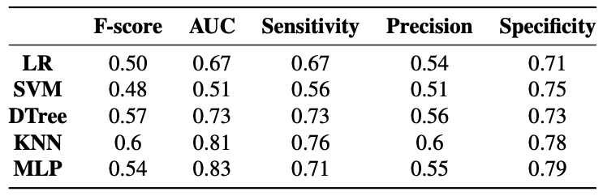
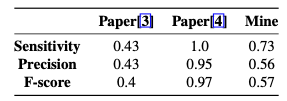

# A Machine Learning Application in Healthcare: Cervical Cancer Biopsia Response Classification

Project for [Machine Learning](https://twiki.di.uniroma1.it/twiki/view/ApprAuto) course (A.Y. 2019/2020), full details are available in the [report](./reportML.pdf).

## Introduction and Motivation
Eleven years ago, cervical cancer ranked the third most common cancer among women worldwide. However, in 42 low-resource countries, it was the most common cancer in women. There were over 500,000 new cases in 2018[[1]](https://www.thelancet.com/action/showPdf?pii=S2214-109X%2819%2930482-6). Usually, all cervical cancers are associated with human papillomaviruses (HPV). However, the majority of women with HPV do not develop cervical cancer. Women become susceptible to developing cervical cancer following HPV infection, but other environmental factors are required for cancer to develop. This is why cervical cancer is a significant cause of mortality in many low-income countries, and the existence of several diagnosis methods allows for the creation of automated methods that can help people prevent cancer and receive focused treatments. Unfortunately, in developing countries, resources are limited. Patients usually do not do routine screening due to financial problems, so predicting the individual patient’s risk and the best screening strategy during her diagnosis becomes a fundamental problem. 

_This project aims to detect cervical cancer based on the Biopsia response._

## Dataset 
The dataset is the **Cervical cancer (Risk Factors) Data Set** from the UCI Machine Learning Repository[[2]](https://archive.ics.uci.edu/ml/datasets/Cervical+cancer+%28Risk+Factors%29). It focuses on predicting indicators/diagnosis of cervical cancer, and it was collected at ’Hospital Universitario de Caracas’ in Caracas, Venezuela. Data comprises demographic information, habits, and historical medical records of 858 patients. Several patients decided not to answer some of the questions because of privacy concerns. The dataset is composed of 858 instances and 36 attributes. Target variables are four: Hinselmann, Schiller, Cytology, and Biopsy.

## Evaluation
Predictions were performed using five different models: _Logistic Regression_, _Support Vector Machine_, _Decision Tree_, _K-Nearest Neighbors_, and _Multi Layer Perceptron_. 

The dataset was split into a 20% Training set and 80% Test set and then performed a Grid-search to find the optimal hyperparameters and a K-Fold Cross-Validation where K=5.

### Results
* The Support Vector Machine is the worst model since it makes a random guess (AUC=0.51).

* The K-Nearest Neighbors and the Multilayer Perceptron classifier are the two best models since they have a value near 1, the maximum value that can be achieved (respectively 0.81 and 0.83).

### Result Comparisons
Decision Tree performances' were compared with [[3]](http://www.ijctjournal.org/Volume4/Issue4/IJCT-V4I4P19.pdf) and [[4]](https://arxiv.org/pdf/1812.10383.pdf), that both used the same dataset with a dtree classifier. In the below image, it is possible to see the results.

## Conclusions
The dataset was truly imbalanced; almost all features have values of 0, and only a few target variables had a positive result for the Biopsy test (and for all the other target features). Using different metrics and implementing sampling techniques on the training set helped a lot, but models still oversampled the test set. The next step could be to try a Cost-Sensitive Learning that considers the misclassification costs to minimize the total cost and try a Multi-label classification with the sum of all the four target features. Several classification tasks could be done using this dataset, but the dataset's most challenging part. Maybe collecting more data could be a possible solution. 
